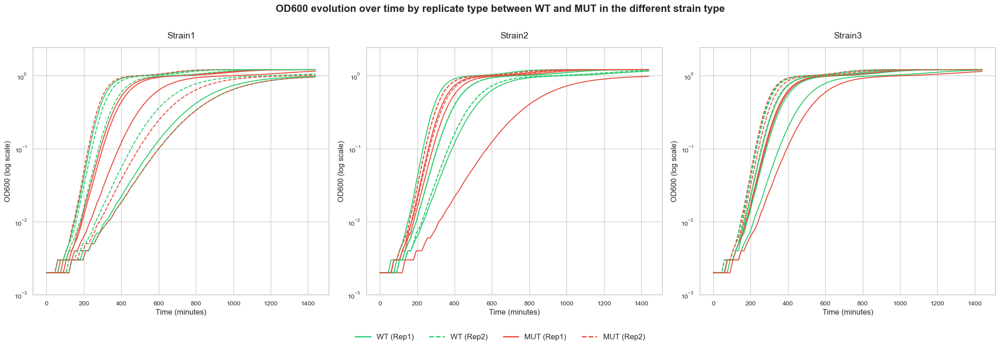
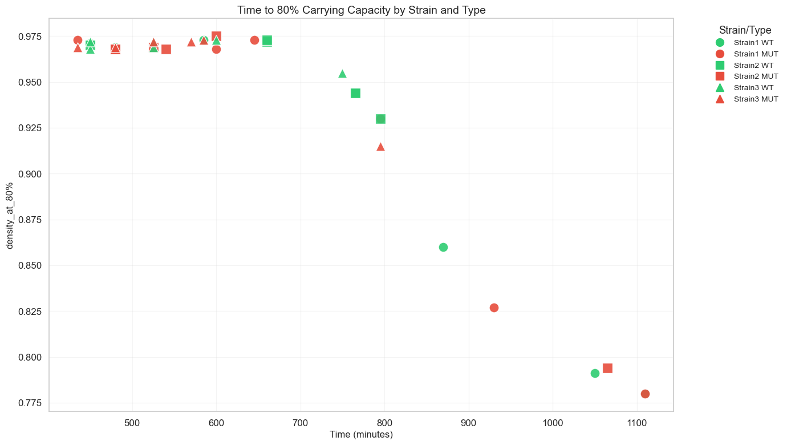
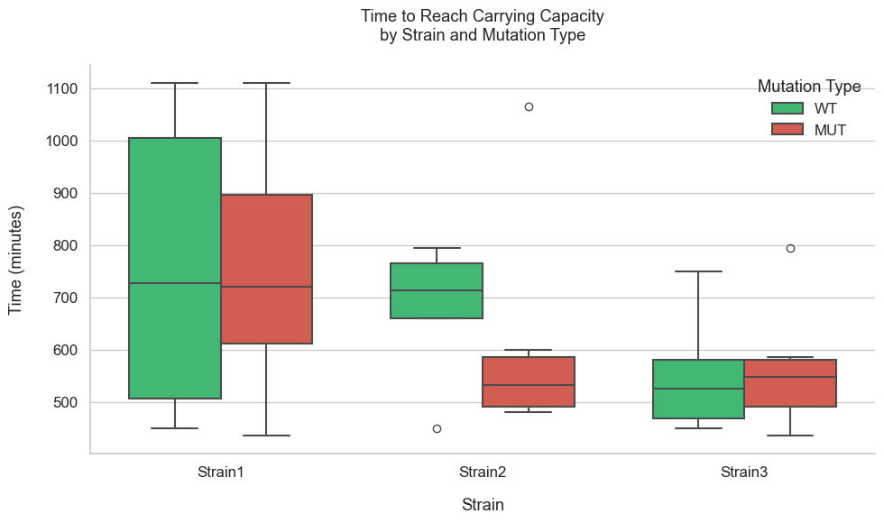

# **Task 1 : Microbiology : Analysing curve growth** 

### Team members:
*Chama Benslimane (leader)* ; GitHub profile : https://github.com/BenslimaneChama
and
*Mohammad Hicham Polo* ; GitHub profile : https://github.com/MohammadHichamPolo
**HackBio Internship - Stage 2 Task**

---
## **Introduction**
This project anlyse the growth curves of different bacterian strains from experimental data. It includes the following steps:
        - First process and trasform raw data
        - Viualize growth for different strains
        - Caclulate the time needed to reach 80% of maximum density (OD600)
        - Perform stastical analyses to compare strains and mutations 
As part of this project, we used the same functions we'd done in the HackBio internship **stage 1**, on the same theme. So we used them and rearranged them.
So this project can be divided into two parts, the part where we reuse the functions, with a slight change, and then the part with the main code.

## Modules needed
But before we get started, let's introduce the libraries we've used to execute our code.
```
import pandas as pd
import numpy as np
import matplotlib.pyplot as plt
import seaborn as sns
from scipy import stats
```
`pandas` : To manipulate the data in dataframe
`numpy` : for advanced calculation
`matplotlib.pyplot` : to trace graphics
`seaborn` : to ameliorate the style of visualisation
`scipy.stats` : for statistical tests on data
## Importing data and creating metadata
Once we've imported the packages we need, we'll import our folder to start work, creating the metadata.
A metadata, is a Dataframe, that is like the data I just imported, but completes it.
```
# Importing data
data = pd.read_csv("mcgc.tsv",  sep='\t')
# Creating metadata
metadata = pd.DataFrame({
    "Strain": [
        "Strain1_Rep1", "Strain1_Rep2", "Strain2_Rep1",
        "Strain2_Rep2", "Strain3_Rep1", "Strain3_Rep2"
    ],
    "WT_1": ["A1", "A3", "A5", "A7", "A9", "A11"],
    "MUT_1": ["A2", "A4", "A6", "A8", "A10", "A12"],
    "WT_2": ["B1", "B3", "B5", "B7", "B9", "B11"],
    "MUT_2": ["B2", "B4", "B6", "B8", "B10", "B12"],
    "WT_3": ["C1", "C3", "C5", "C7", "C9", "C11"],
    "MUT_3": ["C2", "C4", "C6", "C8", "C10", "C12"]
})
```
To better explain, in this tab, the experimenters carried out an experiment with Wild Type (`WT`) bacteria, but changed their environments (A1, B1, C1), so they carried out the same experiment with other bacteria to verify the results. Basically, we'd made replicates.
The same applies to the mutants (`MUT`) : they were subjected to different environments, and replicates were also made.
So, the main reason for this project is to compare mutants and wt, and find out if there are any differences.

---
## I. Functions
As We said earlier, these functions have already been used in Stage 1, the HackBio course, but it's the way they're used that's distinctive.
### *1st Function*
The main purpose of this function : is to convert raw data into a structure that is easier to analyze and plot. In other words, This function converts a DataFrame where columns are curves and rows are time points into a structure where rows are curves and columns are time points.
```
# The fucntion :
def convert_to_curve_time_structure(data): #data is the parameter
```
In this section, we reorganize the data so that time is the main axis, making it easier to access and analyze each curve. We also extract the time values, so that we can retrieve the time values to plot the curves later.
As we saw in Stage 1, functions only work once, when you call them up with the return command.
```
    return transposed_data, x_values
```
Here we returned `transposed_data` which is : Data organized in a usable format.
and `x_values` that is the time listed for graphs.

### *2nd Function*
Here, we are going to melt the metadata dataframe, so that it can be compatible to the actual data stru. Which means that this function converts metadata into a long format so that it is compatible with experimental data.
```
# The fucntion :
def process_metadata(metadata_df):
```
So we started by creating an empty list to store each curve in a structured format, then went through each line of metadata to analyze each strain and its associated information. We then extracted the strain and replicate so that `Strain1_Rep1` becomes `strain` = `Strain1`, and `rep` = `Rep1`. Then we associated each WT and MUT sample to retrieve all the experiments associated with a strain, and finally added these data to the list to record each WT and MUT curve with its characteristics (strain, replicate, experiment). 
```
# We return the function
return pd.DataFrame(melted)
```
Once the function has been returned, we can transform the lite `melted` into a well-structured array.
### *3rd Function*
In this function We used the same logic we plotted with using FUNCTION2 (not FUNCTION3)in stage 1. This plots bacterial growth curves (OD600 vs. Time) for each strain, differentiating between WT and MUT types with different colors and line styles. This is very useful for visualizing the evolution of bacterial growth over time, and helps to compare MUT mutants and WT wild types to see if there is a mutation effect.
```
# The fucntion :
def plot_strain_curves(converted_data, x_values, unit_type="min"):
```
First of all, we retrieved metadata, i.e. information on each curve (WT/MUT, strain, replicate), then we created 3 side-by-side graphs to compare strains, and defined colors and styles to be able to differentiate mutants and replicates visually. Then we loop over each strain to plot its curves, associating each with its characteristics, and after using a logarithmic scale, which allows us to better see the variations in growth at the beginning and end, we also add the legends and generate the graph for display. 
```
plt.show()
```


### *4th Function*
This function is the exact same function 3 that we used in stage 1, which helps us to determine the moment when the bacterial density reaches 80% of its maximum value, a very useful tool for measuring the time needed to reach an advanced stage of growth and for comparing the growth speed of WT and MUT. 

---
## II. The main Code
This code is called main code, because it allows us to execute required tasks in such a way to orientate program execution by calling the functions explained above and structuring the results. <br/>
1. First, we call up the *first function* to structure the data in a format where each curve becomes a line, and extract the time values to plot the graphs. This is a very important and necessary step for plotting and analysis.
```
converted_data, x_values = convert_to_curve_time_structure(data)
```
2. Secondly, we call up *the second function* to display the OD600 vs. Time curves: this displays a graph for each strain, differentiating between WT (green) and MUT (red) with different styles, and then using the same logarithmic scale as previously mentioned, to better visualize growth.
```
plot_strain_curves(converted_data, x_values, unit_type='min')
```
3. This is where we calculate the time to reach 80% of maximum density, so we go through all the curves (WT/MUT, all strains combined), extract the data from each curve and put them in DataFrame, then apply the `find_80_percent_density`() function to find the maximum density and the time when density will reach 80% of max. All these results are then stored in the `results` list. This calculation is very important, as it allows us to compare how quickly the different strains reach an advanced stage of growth.
```
 results.append({
        'curve_id': curve_id,
        'max_density': max_dens,
        'time_to_80%': time_80,
        'density_at_80%': dens_80
    })
```
4. Once the results have been stored, we now organize them in a dataframe, using Pandas, which facilitates data manipulation, analysis and visualization.
```
results_df = pd.DataFrame(results)
```
5. Here we transform `process_metadata(metadata)`, which has a very large format, into a format that's easier to use. So `merge()` merges the results with the metadata to associate each curve with its strain and type (WT/MUT). Now we can compare growth times according to strain and mutation.

```
curve_metadata = process_metadata(metadata)
results_df = results_df.merge(curve_metadata[['curve_id', 'strain', 'type']], on='curve_id')
```
6. 1. Here we can visualize the results, and therefore the graphs, starting with **Scatter Plot: Time to reach 80% of max density.** This graph shows directly whether WT and MUT have differences in growth rates.
```
plt.title('Time to 80% Carrying Capacity by Strain and Type', fontsize=14)
plt.xlabel('Time (minutes)', fontsize=12)
plt.ylabel('Density at 80%', fontsize=12)
plt.grid(alpha=0.2)
plt.legend()
plt.show()
```
 


  ii.  Then we'll show the **BoxPlot : Comparison of times by strain and mutation**. This statistically compares WT/MUT growth in each strain.
```
plt.figure(figsize=(10, 6))
sns.boxplot(x='strain', y='time_to_80%', hue='type', data=results_df, palette={'WT': '#2ecc71', 'MUT': '#e74c3c'})
plt.title('Time to Reach Carrying Capacity\nby Strain and Mutation Type', pad=20)
plt.xlabel('Strain', labelpad=15)
plt.ylabel('Time (minutes)', labelpad=15)
plt.legend(title='Mutation Type', frameon=False)
sns.despine()
plt.tight_layout()
plt.show()
```


   7. In the last step, we performed statistical tests, which are very important when interpreting graphs. The test we performed is: <br/>
Mann-Whitney U test, because based on the data we have less than 30 records by strain. Which allows us to objectively quantify whether the mutation affects growth, so if p < 0.05, the difference is statistically significant, and if it's the opposite we'd have no significant difference. 
- We did two times the test :
   - The first statical anylsis was between MUT and WT in general
```
#Output
W statistic: 171.50
P-value: 0.775
WT Mean Time: 663.33 min
MUT Mean Time: 644.17 min
```
   - The second statical anylsis was between MUT and WT by strand type
  
```
# OUTPUT :
Strain | WT Mean Time (min) |  MUT Mean Time (min) |W statistic| p-value
Strain1|       757.5        |          752.5       |    17.5   | 1.000000
Strain2|       682.5        |          615.0       |    25.0   | 0.295406
Strain3|       550.0        |          565.0       |    17.0   | 0.935622
```

---

## III Interpretation 

### 1. Graphic 1 (Growth curve)
We can see that WT and MUT follow similar trajectories in the three strains, and the logarithmic scale makes it easier to observe the initial differences, but no clear trend emerges.

### 2. Graphic 2 (Time to reach 80% of capacity)
Here, we can clearly see that the dots are scattered, but WT and MUT remain close, and there's no obvious difference between the colors and shapes (WT vs. MUT).

### 3. Graphic 3 (Time to reach capacity)
As far as Strain1 is concerned, WT does seem to have a very large variance, but the median is close. However, for Strain2 and Strain3, WT and MUT are almost identical.

### 4. General analysis (MUT vs WT overall)
Based on the biostatisticall results we can conclude that, generally, there is no significant difference between mutants and wild-type, in terms of OD recorded, because P-values is superior than 0,05. <br/>
Meaning that the knockout manipulation didn't affect the growth of the bacteria.

### 5. Analysis by strain (Strain1, Strain2, Strain3)
Based on the biostatisticall results we can conclude that, even by strain types, there is no significant difference between mutants and wild-type, in terms of OD recorded, because P-values in the three cases is superior than 0,05. <br/>
Meaning that the knockout manipulation didn't affect the growth of the 3 strains.
