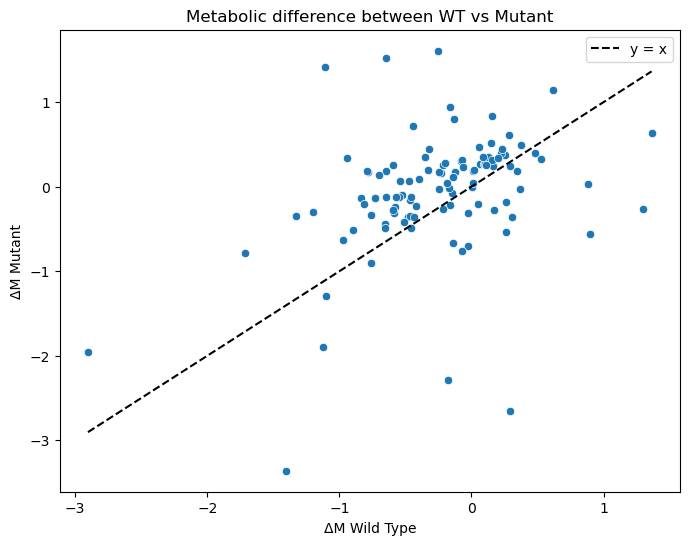
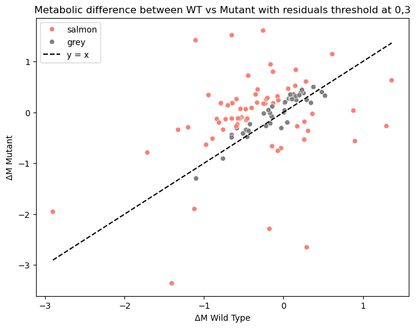
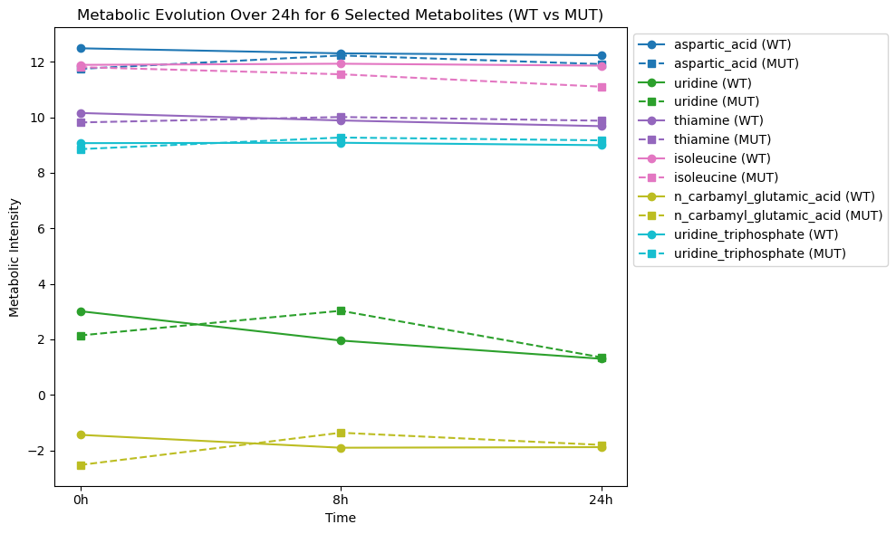

# **Metabolic Response Analysis of Pesticide Treatment in WT and Mutant Cells** 

### Team members:
*Chama Benslimane (leader)* ; GitHub profile : https://github.com/BenslimaneChama
and
*Mohammad Hicham Polo* ; GitHub profile : https://github.com/MohammadHichamPolo
**HackBio Internship - Stage 2 Task**

---
## **Introduction**
This project explores the wild-type (WT) and mutant cell metabolism in response to treatment with a pesticide in Python. We calculate the shifts in metabolism (ΔM), compare differences with a scatter plot, and detect significant varying metabolites. We also monitor the evolution of metabolites over a course of time in order to see how pathways are disturbed. We compare WT and mutant responses in order to get insights on pesticide effects, adaptation in metabolism, and how the metabolism could resist.

## **Required Module**
This analysis is powered by the following Python libraries:
```
pip install pandas numpy matplotlib seaborn
import pandas as pd
import numpy as np
import matplotlib.pyplot as plt
import seaborn as sns
```
`pandas`: For data loading, manipulation, and preprocessing.
`numpy`: For numerical operations, such as computing metabolic differences (ΔM).
`matplotlib`: For creating visualizations, such as scatter and line plots.
`seaborn`: For enhanced statistical plotting and styling.

## **Dataset**
The dataset is sourced from HackBio-Internship 
```
# Importing data
url = "https://raw.githubusercontent.com/HackBio-Internship/2025_project_collection/refs/heads/main/Python/Dataset/Pesticide_treatment_data.txt"
```
## **Extracting Metabolite Concentrations in WT and Mutant Cells**
We extract wild-type (WT) and mutant cell metabolite intensity values before and after treatment with a pesticide.
The dataset’s first column is assigned a name, and we filter rows on conditions like`df["Unnamed: 0"] == "WT_DMSO_1".`
`.iloc[:, 1:]` selects all metabolite columns, and `.values.flatten()` converts them into 1D arrays.

## **Analysis steps**

### **1. Computing Metabolic Differences (ΔM)**
`metabolites = df.columns[1:]` is keeping track of names of all the metabolites in store.
ΔM (Delta M) is determined by subtracting post-treatment and pre-treatment metabolite intensities: 
  - For WT: `WT_24h - WT_DMSO`
  - For Mutants: `Mutant_24h - Mutant_DMSO`

### **2. Scatter Plot of ΔM (WT vs. Mutant)**
- We plot each metabolite's ΔM in WT against ΔM in mutant on a scatter plot.
- The dashed horizontal black line (y = x) represents a uniform metabolism reaction in the two strains.
- If a point is above the line, the mutant increased in the metabolite.
- If a point is below the line, the metabolite decreased more in the mutant.
```
plt.xlabel("ΔM Wild Type")
plt.ylabel("ΔM Mutant")
plt.title("Comparaison de la Réponse Métabolique WT vs Mutant")
plt.legend()
plt.show()
```



This plot graphically shows differences in metabolism in WT and mutant strains.

ANSWERING THE QUESTION: What do the trends on either side of the graph represent?
The reference line y = x serves as a benchmark to evaluate whether metabolic shifts (ΔM) in WT and MUT conditions follow a similar trend.
The distribution of points closely aligns with this line, indicating a strong positive correlation between ΔM in both conditions.
However, as ΔM increases, we notice a greater concentration of points, suggesting that the treatment induces metabolic changes in both WT and MUT to a similar extent.
This implies that while the treatment has a measurable impact, its effect is comparable in both conditions.

### **3. Residuals & Outlier Detection**
We calculate residuals to measure the difference:
```
residuals = deltaM_Mutant - deltaM_WT
```
Threshold = 0.3:
- Grey points: Within threshold (low variation).
- Salmon points: Beyond threshold (high variation, key outliers).
```
plt.plot(x_vals, x_vals, color='black', linestyle='--', label="y = x")
plt.xlabel("ΔM Wild Type")
plt.ylabel("ΔM Mutant")
plt.title("Metabolic difference between WT vs Mutant with residuals threshold at 0,3")
plt.legend()
plt.show()
```



Outliers represent metabolites with a strong differential response, helping us focus on key biological changes.
ANSWERING THE QUESTION : What are these metabolites ?
After running len(outliers), we find that 65 out of 108 metabolites are classified as outliers based on the 0.3 threshold.
The density of outliers increases as ΔM grows, suggesting that metabolic variations become more pronounced with larger changes.
Despite the ongoing metabolic activity, these outliers likely exhibit a significant ΔM difference, indicating that they are particularly sensitive to the treatment.

### **4. Extracting Outlier Metabolites**
We filter and extract the names of metabolites where residuals exceed the 0.3 threshold.
The output is a list of key metabolites that undergo significant metabolic shifts.
```
outliers = metabolites[np.abs(residuals) > threshold].tolist()
```
### **5. Time Series Analysis of Selected Metabolites**
This section examines how metabolite levels change over time following pesticide treatment.
Instead of analyzing just one time point (24h), we track metabolic changes at 0h, 8h, and 24h.<br/>
So first we select metabolites for the time series Plot, because we can't plot all 65 outliers at once. Then we prepare the time series data, because the figure size ensures clear visualization, and different colors help distinguich metabolite trends.<br/>
And on step 3, we plot metabolic changes over time, by looping over the selected metabolites, then we extract the metabolites values at different time points for WT and mutant cells, this let us compare how WT and mutant cells metabolize over time and track trends in metabolic responses.<br/>
On the last step, we Format and siplay the plot 
```
plt.xlabel("Time")
plt.ylabel("Metabolic Intensity")
plt.title("Metabolic Evolution Over 24h for 6 Selected Metabolites (WT vs MUT)")

plt.legend(loc="upper left", bbox_to_anchor=(1,1))
plt.tight_layout()  
plt.show()
```



## Interpretation 
### **1. Graphic 1 : Scatter Plot (Metabolic Difference Between WT vs Mutant)**
This plot compares the metabolic changes (ΔM) between wild-type (WT) and mutant (MUT) conditions.
The black dashed line represents the ideal case where WT and MUT have identical metabolic differences (y = x).
Points above or below this line indicate variations in metabolism between the two conditions.

### **2. Graphic 2 : Second Scatter Plot (Metabolic Difference Highlighting Residuals)**
This plot builds on the first one by emphasizing points based on a residual threshold (0.3).

Salmon-colored points indicate metabolites with significant deviations between WT and MUT.
Grey points are closer to the expected y = x trend.
This visualization helps identify metabolites that behave differently between conditions.

### **3. Graphic 3 : Second Scatter Plot (Metabolic Difference Highlighting Residuals)**
This graph tracks the metabolic intensity of six selected metabolites over 24 hours for both WT and MUT.
Solid lines represent WT, while dashed lines represent MUT.
Some metabolites follow stable trends, while others fluctuate over time, indicating differences in metabolic processing.
This helps us understand how metabolism evolves differently in mutant cells compared to the wild type.
