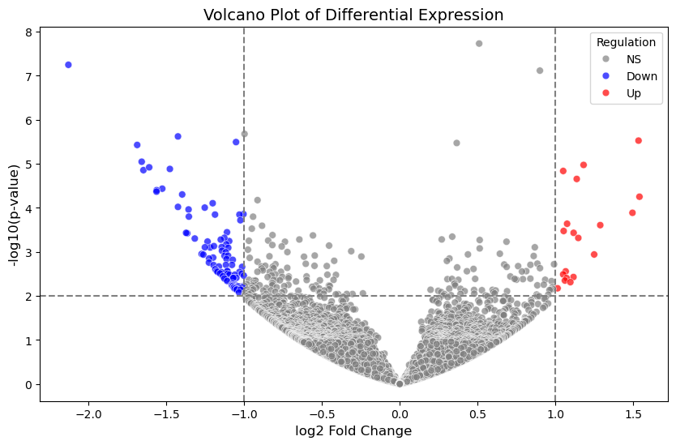
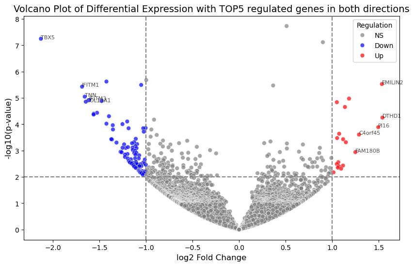

# **Code Analysis: Volcano Plot Generation and Identification of Differentially Regulated Genes**

### Team members:
*Chama Benslimane (leader)* ; GitHub profile : https://github.com/BenslimaneChama
and
*Mohammad Hicham Polo* ; GitHub profile : https://github.com/MohammadHichamPolo
**HackBio Internship - Stage 2 Task**

---
## **Introduction**
This python project was developed as part of the HackBio Internship, stage 2. Its main objective is to generate a volcano plot based on a given dataset and identify the top 5 most overexpressed (upregulated) and underexpressed (downregulated) genes.<br/>
<br/>
A volcano plot : is a graphic representation commonly used in genomic analysis. It displays statistical significance (via the p-value) as a function of the level of expression change (log2 fold change).<br/>
This makes it possible to identify the genes most significantly regulated between two experimental conditions.
<br/>
## **Modules needed**
That is all the librarys needed for the treatment of data and visualisation 
```
import pandas as pd
import numpy as np
import matplotlib.pyplot as plt
import seaborn as sns
import requests
from io import StringIO
```

- `pandas` for data manipulations as a DataFrame.
- `numpy` for mathematical calculation
- `matplotlib.pyplot` & `seaborn`  for plots generations
- `requests` to dowloas datas from an extern URL
- `StringIO` to convert a text into a readable format with `pandas.read_csv()`


## **Importing the data**
We import the url, which already contains the text file containing the results of a differential gene expression analysis, then download the file and store its contents as plain text. This text will then be converted into a format that can be used by `pandas`.
<br/>
```
url = "https://gist.githubusercontent.com/stephenturner/806e31fce55a8b7175af/raw/1a507c4c3f9f1baaa3a69187223ff3d3050628d4/results.txt"
response = requests.get(url)
data = response.text
df = pd.read_csv(StringIO(data), delimiter=r"\s+", engine="python")
```

<br/>
## **-log10(p-value)**
p-value, indicates the statistical significance of a gene, but volcano plot often uses `log10(p-value)` to better distinguish significant genes. As a result, p-value is very small in comparison (e.g. `p-value = 0.00001`), but after transformation, these values will become large. This makes it easier to identify statistically significant genes.

```
df['neg_log_pvalue'] = -np.log10(df['pvalue'])
```

## Creating Volcano Plot
with `seaborn.scatterplot()` <br/>
<br/>
We add the condition that if a gene changes expression by more than a factor of 2 (log2FoldChange > 1 or < -1) and p-value < 0.01, it is considered significant.<br/>
<br/>
“Up” in red (overexpressed).<br/>
“Down” in blue (underexpressed).<br/>
“NS” (non-significant) in grey.<br/>
<br/>
```
plt.figure(figsize=(10, 6))
sns.scatterplot(data=df, 
                x='log2FoldChange', 
                y='neg_log_pvalue',
                hue=np.where((df['log2FoldChange'].abs() > 1) & (df['pvalue'] < 0.01), 
                              np.where(df['log2FoldChange'] > 1, 'Up', 'Down'), 
                              'NS'),
                palette={'Up': 'red', 'Down': 'blue', 'NS': 'gray'},
                alpha=0.7,
                s=40)
```

We add visual threshold, to identify sigificative genes.
- Upregulated : log2FoldChange > 1 et p-value < 0.01.
- Downregulated : log2FoldChange < -1 et p-value < 0.01.
```
plt.axvline(-1, color='gray', linestyle='--')
plt.axvline(1, color='gray', linestyle='--')
plt.axhline(-np.log10(0.01), color='gray', linestyle='--')

plt.title('Volcano Plot of Differential Expression', fontsize=14)
plt.xlabel('log2 Fold Change', fontsize=12)
plt.ylabel('-log10(p-value)', fontsize=12)
plt.legend(title='Regulation', loc='upper right')
plt.show()
```
Once the thresholds have been set, the volcano plot looks like this: 



Now, from all the data we have, we're going to choose the 5 most expressed genes, and the 5 least expressed.

```
top5_up = upregulated.nlargest(5, 'log2FoldChange')
top5_down = downregulated.nsmallest(5, 'log2FoldChange')
```

We then print the results, displaying the top 5 genes (Up & Down) with their log2FoldChange and p-value.
 
In the last step, we add their names to the top 5 genes, whether up or down, for easier visualization. 
```
for _, row in pd.concat([top5_up, top5_down]).iterrows():
    plt.text(row['log2FoldChange'], row['neg_log_pvalue'], row['Gene'], 
             fontsize=8, alpha=0.7)

plt.show()
```




## **FINAL INTERPRETATION :**
Upregulated genes suggest increased extracellular matrix remodeling, apoptosis, and cardiovascular regulation.
Downregulated genes point to reduced antiviral response, altered developmental pathways, and potential connective tissue or cardiac implications.
If linked to a specific disease or condition, this pattern might indicate a response to infection, tissue repair mechanisms, or developmental disturbances.
