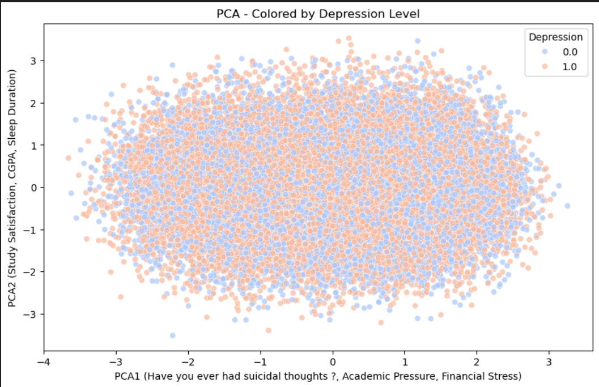
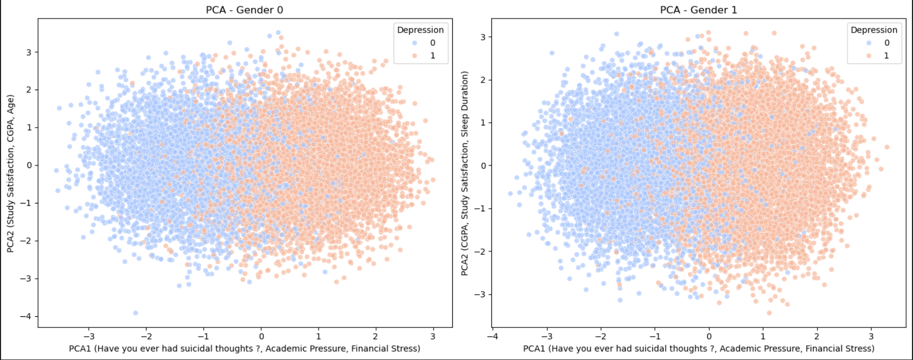
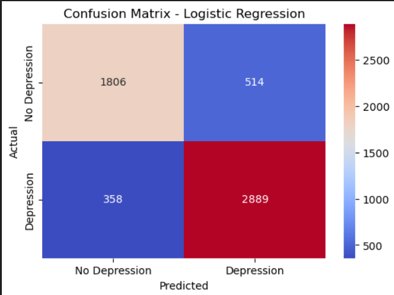
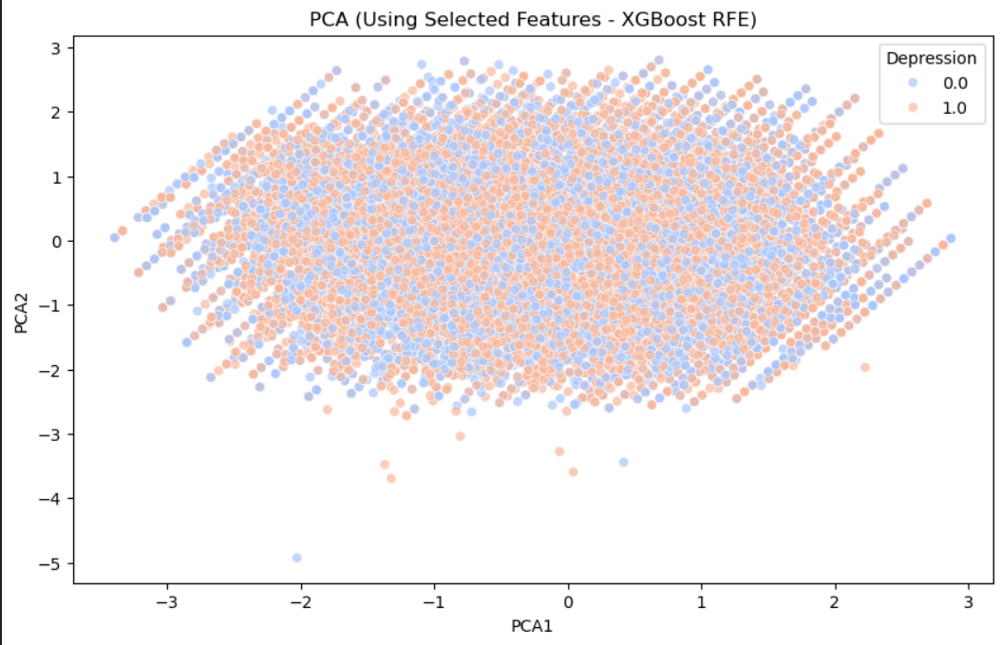
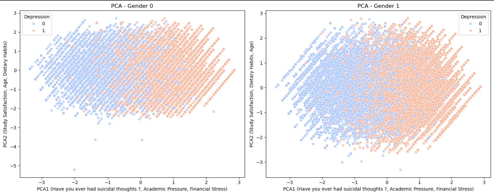
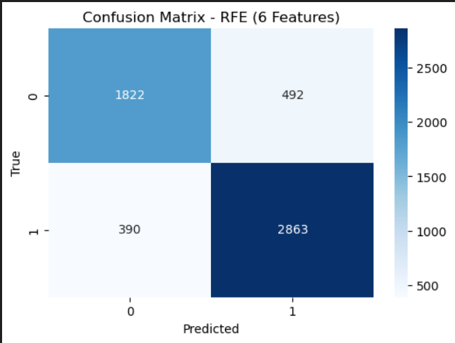

# **Stage 3 - HackBio Internship: Neuroscience and Psychology**

### Team members:
*Chama Benslimane (leader)* ; GitHub profile : https://github.com/BenslimaneChama
and
*Mohammad Hicham Polo* ; GitHub profile : https://github.com/MohammadHichamPolo

## Project Overview

This project is part of the Stage 3 HackBio Internship, focusing on neuroscience and psychology. The objective is to analyze a dataset and use biostatistical and machine learning techniques to classify and detect signs of depression in university students.

what we did in this project :
   - Data preprocessing and exploration
   - Machine learning classification models
   - Biostatistical analysis of relevant factors
   - Visualization and interpretation of results
## Table of Contents
1. [Project Overview](#project-overview)  
2. [Modules Needed](#modules-needed)  
3. [Data Importing](#data-importing)  
4. [Data Treatment](#data-treatement)  
5. [Minimum Number of Predictive Variables Investigation](#minimum-number-of-predictive-variables-invistigation)  
6. [Investigation of Predictive Variables and Benchmarking of Trained Models](#investigation-of-predictive-variables-and-benchmarking-of-trained-models)  
7. [Training Results of All Classification Models](#training-results-of-all-classifications-modeles)  
8. [Chosen Trained Classifiers to Predict Depression](#chosen-trained-classifiers-to-predict-depression-and-determining-top-explaining-variables)  
   - [All Features Logistic Regression](#all-features-logistic-regression)  
   - [XGBoost with RFE = 6](#xgboost-with-rfe--6)  
9. [Answering Questions](#answering-questions)  
-------------------
## Modules needed
Here is the modules that we used in order to execute our code : 
```
import pandas as pd
import numpy as np
import matplotlib.pyplot as plt
import seaborn as sns
from sklearn.preprocessing import LabelEncoder
from sklearn.preprocessing import StandardScaler
from sklearn.decomposition import PCA
from sklearn.feature_selection import RFE
from sklearn.linear_model import LogisticRegression
from sklearn.ensemble import RandomForestClassifier
from xgboost import XGBClassifier
from sklearn.model_selection import train_test_split
from sklearn.metrics import accuracy_score, confusion_matrix, classification_report
```
## Data importing 
As our dataset was online, we needed to import it from a url, and as it was in csv format, we transformed it into a table.
```
df = pd.read_csv('http://raw.githubusercontent.com/HackBio-Internship/2025_project_collection/refs/heads/main/Python/Dataset/Student%20Depression%20Dataset.csv')
df # To viualise the dataframe
```
However, we noticed that the data was in the form of str text, and so the machine would be almost incapable of learning from qualitative data.

## Data Treatement
First, we remove the empty cells and filter the data to keep only the rows where the profession is "student" and both job satisfaction and work pressure are equal to 0. Once this is ensured, we proceed to delete the profession, work pressure, and job satisfaction columns.
Next, we focused on the city column, printing each city's data uniquely to get a clear overview of the available entries.
```
print(df['City'].unique())
```
The output : 
```
['Visakhapatnam' 'Bangalore' 'Srinagar' 'Varanasi' 'Jaipur' 'Pune' 'Thane'
 'Chennai' 'Nagpur' 'Nashik' 'Vadodara' 'Kalyan' 'Rajkot' 'Ahmedabad'
 'Kolkata' 'Mumbai' 'Lucknow' 'Indore' 'Surat' 'Ludhiana' 'Bhopal'
 'Meerut' 'Agra' 'Ghaziabad' 'Hyderabad' 'Vasai-Virar' 'Kanpur' 'Patna'
 'Faridabad' 'Delhi' 'Saanvi' 'M.Tech' 'Bhavna' 'Less Delhi' 'City' '3.0'
 'Less than 5 Kalyan' 'Mira' 'Harsha' 'Vaanya' 'Gaurav' 'Harsh' 'Reyansh'
 'Kibara' 'Rashi' 'ME' 'M.Com' 'Nalyan' 'Mihir' 'Nalini' 'Nandini'
 'Khaziabad']
```

The presence of lines that are not cities, such as 'Me' or 'M.Com', is very noticeable, and can really distort the learning process, as well as the results, should the city perhaps be a factor in depression. 
To remedy this problem, we created a list of valid cities, and deleted any lines presenting something different. We then assigned a number to each of these cities, in order to digitize our data and make it easier for the machine to learn. We also created a dictionary, with each city showing the number assigned to it, so as not to get lost in the future.

```
{'Agra': 0, 'Ahmedabad': 1, 'Bangalore': 2, 'Bhopal': 3, 'Chennai': 4, 'Delhi': 5, 'Faridabad': 6, 'Ghaziabad': 7, 'Hyderabad': 8, 'Indore': 9, 'Jaipur': 10, 'Kalyan': 11, 'Kanpur': 12, 'Kolkata': 13, 'Lucknow': 14, 'Ludhiana': 15, 'Meerut': 16, 'Mumbai': 17, 'Nagpur': 18, 'Nashik': 19, 'Patna': 20, 'Pune': 21, 'Rajkot': 22, 'Srinagar': 23, 'Surat': 24, 'Thane': 25, 'Vadodara': 26, 'Varanasi': 27, 'Vasai-Virar': 28, 'Visakhapatnam': 29}
```
In the same way, we have continued to digitize our data, in a rather automatic way, except for Sleep Duration, which includes important and complex data, that we would have to do manually.
```
sleep_mapping = {
    'Less than 5 hours': 4,
    '5-6 hours': 5.5,
    'Others': 6.5,
    '7-8 hours': 7.5,
    'More than 8 hours': 9
}

df['Sleep Duration'] = df['Sleep Duration'].map(sleep_mapping)
```
Now that we've taken a look at all the information in the dataset, we can see that there's no longer any data in text form, and that everything has been transformed into digital data. So we could start creating a machine to detect depression. 

-----------------------------------

In our original code, available as a Jupyter notebook on GitHub, we experimented with three different models, testing various feature combinations to achieve the best accuracy and predictions. Here, we present only the two best-performing models. For further details, you can refer to the provided Jupyter notebook.
--------------------------------
## Minimum number of predictive variables invistigation

To invistigate the number of variables needed to explain depression, we utilized Principal Component Analysis (PCA) for 2D visualization, selecting only the principal components (PCs) necessary for this representation. PCA's job is to reduce the number of features by creating new "principal components" that capture the most variance (information) in the data. And in order to visualise thoe data in 2D, we chosed 2 Principal components 1 and 2.

Through this, we observed that PC1 selected three dominant features that had the most influence (Financial stress, Suicidal thoughts & Academic pressure), while PC2 highlighted three other important variables that describe different aspects of the data (CGPA, study satisfaction & Sleep Duration). 



However, as seen in the graph, the points overlap, making it difficult to distinguish between the orange points (students with depression) and the blue points (students without depression).

What’s important to note here is that on the x-axis, PC1 selected Suicidal thoughts, Academic Pressure, and Financial Stress, while on the y-axis, PC2 selected CGPA, Study Satisfaction, and Sleep Duration. This indicates that, according to Logistic Regression, these were the most significant features in the dataset.

So we decided to separate the genders to see if visualization would ever be easier.
     - **0: Women, 1: Men**.


As a matter of fact, we could see that each color starts to take a side, one dominant on the left and the other on the right; although there's no line separating the two, it shows that the selected features can indeed detect depression and predict whether a person is affected or not.

This helped us conclude that only 6 variables could be enough to distinguish between depressed and healthy students guiding our feature selection process.
## Investigation of Predictive Variables and Benchmarking of Trained Models
In this section, we conducted a benchmark analysis comparing three Machine Learning models: Logistic Regression, Random Forest, and XGBoost. The benchmarking process involved training these models using three different approaches:

1. All Features: Training the models with the complete set of data features.
2. Selected Features: Utilizing only six features selected through Recursive Feature Elimination (RFE), based on prior Principal Component Analysis (PCA) results indicating that this subset was sufficient.
3. Single Best Feature: Training each model using only the most influential feature identified by RFE, allowing us to assess its individual contribution and overall impact on detecting depression symptoms in students.
## Training results of all classifications modeles

| Model                                      | Features Used                                                      | Accuracy (%) | Precision (0/1) | Recall (0/1) | F1-score (0/1) | Macro Avg F1 | Weighted Avg F1 | False Positives | False Negatives |
|--------------------------------------------|--------------------------------------------------------------------|--------------|----------------|-------------|---------------|--------------|----------------|----------------|----------------|
| **Logistic Regression (All Features)**     | All features                                                      | **84.34**    | 0.83 / 0.85    | 0.78 / 0.89 | 0.81 / 0.87   | 0.84         | 0.84           | 514            | 358            |
| **Logistic Regression (RFE - 6 Features)** | Academic Pressure, Study Satisfaction, Dietary Habits, Suicidal Thoughts, Financial Stress, Family History | 83.92        | 0.83 / 0.84    | 0.77 / 0.89 | 0.80 / 0.87   | 0.83         | 0.84           | 529            | 366            |
| **Logistic Regression (RFE - 1 Feature)**  | Suicidal Thoughts                                                 | 78.68        | 0.78 / 0.79    | 0.68 / 0.86 | 0.73 / 0.83   | 0.78         | 0.78           | 741            | 446            |
| **Random Forest (All Features)**           | All features                                                      | 84.25        | 0.83 / 0.85    | 0.78 / 0.89 | 0.80 / 0.87   | 0.84         | 0.84           | 515            | 362            |
| **Random Forest (RFE - 6 Features)**       | Age, City, Academic Pressure, CGPA, Suicidal Thoughts, Financial Stress | 81.91   | 0.80 / 0.83    | 0.76 / 0.86 | 0.78 / 0.85   | 0.81         | 0.82           | 563            | 444            |
| **Random Forest (RFE - 1 Feature)**        | Suicidal Thoughts                                                 | 78.68        | 0.78 / 0.79    | 0.68 / 0.86 | 0.73 / 0.83   | 0.78         | 0.78           | 741            | 446            |
| **XGBoost (All Features)**                 | All features                                                      | 83.76        | 0.82 / 0.85    | 0.78 / 0.88 | 0.80 / 0.86   | 0.83         | 0.84           | 518            | 386            |
| **XGBoost (RFE - 6 Features)**             | Age, Academic Pressure, Study Satisfaction, Dietary Habits, Suicidal Thoughts, Financial Stress | 84.16 | 0.82 / 0.85    | 0.79 / 0.88 | 0.81 / 0.87   | 0.84         | 0.84           | 492            | 390            |
| **XGBoost (RFE - 1 Feature)**              | Suicidal Thoughts                                                 | 78.46        | 0.78 / 0.79    | 0.68 / 0.86 | 0.72 / 0.82   | 0.78         | 0.78           | 743            | 456            |

This table summarizes all model performance metrics and selected features when RFE is applied. Key insights from the results include:

✅ Best Overall Model → Logistic Regression (All Features) with 84.34% Accuracy. 

✅ Best Model After Feature Selection (RFE) → XGBoost with RFE (6 Features) achieving 84.16% Accuracy. 

❌ Worst Performing Models → All models trained with only 1 feature, reducing accuracy to approximately 78%. 

❌ Most Common False Prediction Trend → Increased false negatives (missed depressed students) when reducing the number of features. 

✅ Key Predictive Feature → "Have you ever had suicidal thoughts ?" was consistently selected by all models when RFE = 1, demonstrating an individual contribution of ~78%. 

## Chosen Trained Classifiers to predict depression and determining top explaining variables:
### ALL FEATURES LOGISTIC REGRESSION
We decided to consider Logistic Regression as it is a simple yet effective model for making binary Yes or No decisions.

In this approach, we did not apply Recursive Feature Elimination (RFE), meaning all features were included for training and prediction.
To find out how reliable this model is, we used the Confusion matrix, which gives us values on its accuracy, but also how many errors it made. 
The result of its accuracy was 0.8434, which means that the logistic regression performed very well, with an accuracy of 84%, which means that we were able to select features that contribute very well to the prediction of depression.



For the confusion matrix, we obtained results of 1806 true negatives and 2889 true positives, values almost three times higher than the false predictions.

---------------
### XGBoost WITH RFE = 6
Following the same steps, this time we used another model: *XGBoost* . This is one of the most powerful machine learning algorithms, offering increased accuracy and efficiency. Using an optimized gradient reinforcement technique, it reduces errors by using a reinforcement framework. It handles missing values well, prevents over-fitting through regularization and works efficiently on large datasets. Given its performance, we used it as the final model to maximize accuracy and refine our understanding of depression prediction.

So here we selected 6 features, thanks to RFE, and then train our machine with them.
The results show that XGBoost had chosen features which are very logical, and which would indeed have a great impact on the cause of depression (Age, Academic pressure, Study satisfaction, Dietary Habits, Suicidal thoughts, and Financial stress).

Once again, using PCA, we were able to visualize the distribution of points, but the dots, as for the first time, were indistinguishable, overlapping, and made no sense.



That's why, once again, we've separated the graphs, by plot, showing us a good result, although there are still no separating lines between the two. 



As with logistic regression, we have calculated Confusion metrix, to know its accuracy, and how many errors it has made. 



The results show that its accuracy is very high, at around 84.15%, and with a very low error rate, compared to the 8 other models we ran, and this by working with only a few features, not like Logistic Regression, which has the highest score, but with all the features.

## Answering Questions :
### Can you describe what features determine depression in university students?
PCA plots revealed no clear separation between depressed and non-depressed students, highlighting the complexity of depression, which cannot be accurately predicted using just one or two variables. However, certain features show strong correlations with depression. Notably, suicidal thoughts were consistently selected as the most influential predictor when RFE = 1, contributing approximately 78% to model performance.

The most significant features, as identified by XGBoost, include:

Age
Academic Pressure
Study Satisfaction
Dietary Habits
Suicidal Thoughts
Financial Stress
### Can you build a classification model to accurately predict depressed student?
The XGBoost model with RFE (6 features) was selected as the most efficient classification model. It achieves nearly the same accuracy as the Logistic Regression model trained on all features while requiring fewer inputs and maintaining the lowest False Positive Rate among all trained models.

However, the Logistic Regression model trained on all features remains the most accurate overall. Users can opt for this model if they are willing to input all 13 features for prediction.
### What would you tell people to watch out for if they were depressed?
Based on this dataset, students already experiencing depression should pay attention to the six key predictive features. However, many of these, such as age and past suicidal thoughts, are unchangeable. Among the selected features, dietary habits stand out as the only modifiable factor.

Improving dietary habits may be a practical step for both managing and preventing depression.
